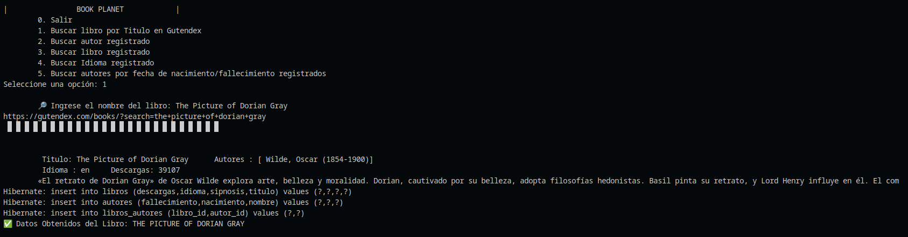
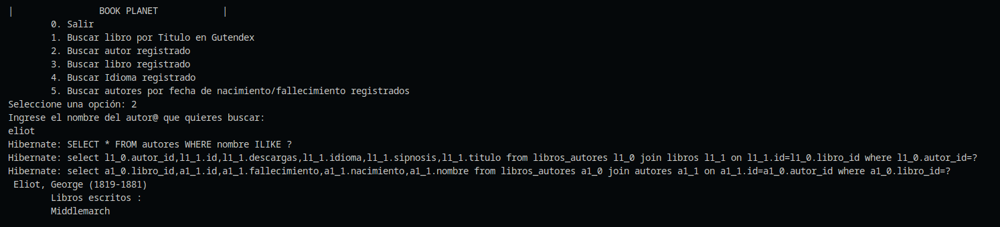
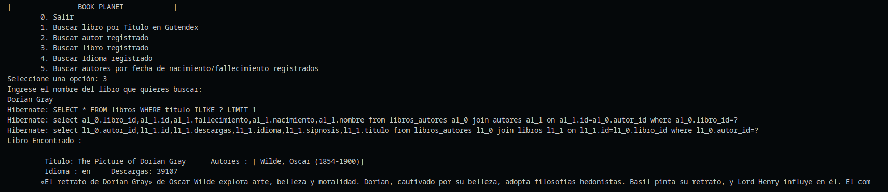
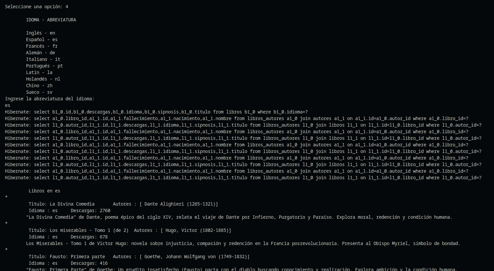
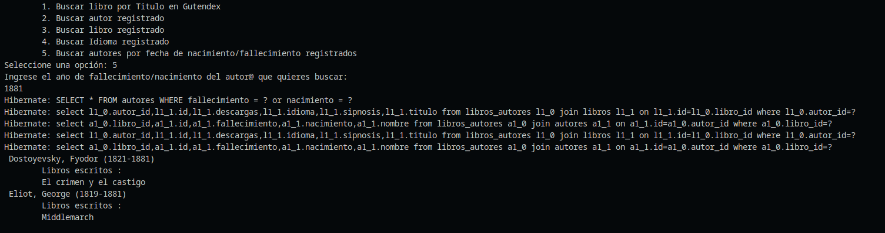
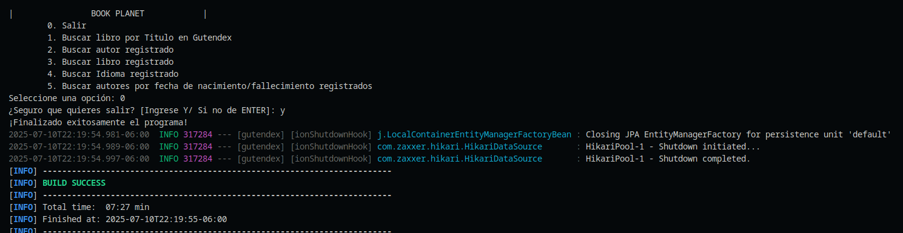

# 📚 Gutendex - Book Planet: Proyecto de Consola para Libros y Autores

¡Bienvenido a **Gutendex - Book Planet**!  
Este es un proyecto educativo y demostrativo que te enseña cómo crear una aplicación de consola en Java (Spring Boot) para consultar, almacenar y mostrar información de libros y autores usando la API pública de Gutendex y una base de datos PostgreSQL.

---

## 🧩 ¿Qué aprenderás con este proyecto?

- Cómo consumir una API externa (Gutendex) para obtener datos de libros y autores.
- Cómo guardar información en una base de datos PostgreSQL.
- Cómo crear un menú interactivo en consola para consultar y filtrar datos.
- Cómo traducir y resumir sinopsis usando la API de Gemini.
- Cómo usar Docker para facilitar la configuración de la base de datos.
- Cómo organizar un proyecto real con buenas prácticas.

---

## 📂 Estructura del Proyecto

```sh
gutendex/
│
├── src/main/java/         # Código fuente principal (Java, Spring Boot)
├── src/test/java/         # Pruebas unitarias
├── docker/                # Archivos para base de datos y pgAdmin (Docker)
├── README.md              # Acerca del proyecto
└── pom.xml                # Dependencias Maven
```

---

## 🚦 Requisitos Previos

- **Java 17** o superior ([descargar aquí](https://adoptium.net/))
- **Maven** ([descargar aquí](https://maven.apache.org/download.cgi))  
  (o usa el wrapper incluido: `./mvnw`)
- **Docker** ([descargar aquí](https://www.docker.com/products/docker-desktop/))  
  (opcional, pero recomendado para la base de datos)
- **Visual Studio Code** ([descargar aquí](https://code.visualstudio.com/))  
  (opcional, pero recomendado para editar y probar el proyecto)

---

## ⚙️ Instalación y Configuración Paso a Paso

### 1. Clona el repositorio

```sh
git clone https://github.com/tu-usuario/gutendex.git
cd gutendex
```

### 2. Configura las variables de entorno y propiedades

- Copia los archivos de ejemplo y edítalos con tus datos:

```sh
cp src/main/resources/application.properties.example src/main/resources/application.properties
cp docker/.env.example docker/.env
```

- **Edita** `src/main/resources/application.properties`  
  Coloca tu clave de la API Gemini y los datos de conexión a la base de datos.

- **Edita** `docker/.env`  
  Pon los datos de usuario, contraseña y base de datos para PostgreSQL y pgAdmin.

### 3. Levanta la base de datos y pgAdmin con Docker

```sh
cd docker
docker-compose up -d
cd ..
```

Esto creará dos servicios:
- **db**: PostgreSQL (puerto 5432)
- **pgadmin**: Herramienta web para administrar la base de datos ([http://localhost:8080](http://localhost:8080))

> Puedes detener los servicios con:  
> `docker-compose down`

### 4. Instala las dependencias y ejecuta el proyecto

```sh
./mvnw spring-boot:run -Dspring-boot.run.arguments=--cli
```

Esto compilará y ejecutará el menú interactivo en la terminal.

---

## 🛠️ ¿Qué hace cada parte?

- **Spring Boot**: Expone la lógica para consultar y guardar libros y autores.
- **Gutendex API**: Busca información de libros y autores.
- **Gemini API**: Traduce y resume sinopsis de libros.
- **PostgreSQL**: Guarda toda la información para consultas rápidas.
- **pgAdmin**: Herramienta web para ver y administrar la base de datos.

---

## 📖 Acerca de la API de Gutendex

La [API de Gutendex](https://gutendex.com/) es una API pública que permite consultar información sobre miles de libros y autores del Proyecto Gutenberg. Puedes buscar libros por título, autor, idioma y más, de forma gratuita y sencilla.

---

## 🧪 Menú Interactivo y Casos de Uso

Al iniciar el programa, verás un menú como este:

```
|        BOOK PLANET        |
    0. Salir
    1. Buscar libro por Titulo en Gutendex
    2. Buscar autor registrado
    3. Buscar libro registrado
    4. Buscar Idioma registrado
    5. Buscar autores por fecha de nacimiento/fallecimiento registrados
Seleccione una opción:
```

A continuación se muestra una tabla con ejemplos visuales de cada opción del menú interactivo.  

<table>
  <tr>
    <th>Opción</th>
    <th>Descripción</th>
    <th>Imagen</th>
  </tr>
  <tr>
    <td>Buscar libro por título</td>
    <td>Consulta la API de Gutendex y muestra resultados en consola.</td>
    <td></td>
  </tr>
  <tr>
    <td>Buscar autor registrado</td>
    <td>Muestra los autores guardados en la base de datos.</td>
    <td></td>
  </tr>
  <tr>
    <td>Buscar libro registrado</td>
    <td>Lista los libros almacenados en la base de datos.</td>
    <td></td>
  </tr>
  <tr>
    <td>Buscar idioma registrado</td>
    <td>Filtra libros por idioma en la base de datos.</td>
    <td></td>
  </tr>
  <tr>
    <td>Buscar autores por fecha</td>
    <td>Busca autores por año de nacimiento o fallecimiento.</td>
    <td></td>
  </tr>
  <tr>
    <td>Salir Programa</td>
    <td>Finaliza la ejecución del programa.</td>
    <td></td>
  </tr>
</table>

---

## 💡 Consejos para Principiantes

- **Lee los comentarios** en el código, están pensados para ayudarte a entender cada parte.
- Si tienes errores de conexión, revisa que Docker esté corriendo y que los archivos `.env` y `application.properties` tengan los datos correctos.
- Puedes modificar el código para practicar y ver los cambios en tiempo real.
- Explora el proyecto para aprender cómo se conectan los servicios y la base de datos.

---

## 👩‍💻 Créditos

- Practica planificada por [Alura Latam](https://www.aluracursos.com/)
- Elaborado por: [jmikhaelz](https://www.linkedin.com/in/jmikhaelz/)

---
